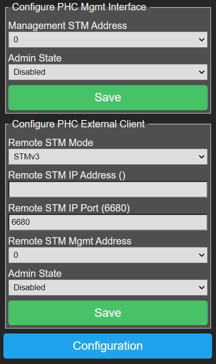

!!! warning 
    Phc2Mqtt is not a commercial product and support is limited. 
    You have to be willing to research and solve potential problems yourself. 
    The author has no liability, you can use this software at your own risk.

##Abbreviations
| Term                  | Description                            
|-----------------------|----------------------------------------
| IP | Internet Protocol, the networking protocol that runs over Ethernet (wired) or Wifi (wireless)  
| TCP | Transmission Control Protocol, runs on top of IP and is a connection oriented protocol
| HTTP | HyperText Transfer Protocol, runs on top of TCP in a request-reponse model
| XMLRPC | XML encoded Remote Procedure Call, this protocol is used by the PHC Systemsoftware v3 to configure an STMv3. The commands are encoded in XML and the request is sent over HTTP
| MQTT | A compact telemetry protocol typically used in IoT applications, runs over TCP
| PHC | PEHA Home Control domotic system  
| STM | STeering Module, the central processor in a PHC system
| System Software | THe Windows application to configure and program your PHC system  
| PCB | Printed Circuit Board, a non-conductive material with copper patterns on 1 or 2 sides to interconnect electronic components
| ESP32 DevkitC | The ESP32 dual core module that is used for Phc2Mqtt, we use the WROVER version with 4Mb/8Mb flash memory and 4Mb PSRAM
| P2M | The combination of the hardware and software that make up the functionality of Phc2Mqtt
| Sub-system | A functional part of P2M that performs a certain task and is under supervision of P2M
| NVS | Non-volatile storage, a part of memory that stores data and settings permanently, even when power fails
| Admin State | Administrative state (enable/disable) is saved in NVS memory, the wanted running state of a sub-system after rebooting P2M  
| Oper State | Operational state (stopped/started), this is the actual running state of a sub-system. A sub-system will be stopped when booting P2M, if the admin state is enable, then the sub-system will be started and the oper-state will become started  
| AP-mode | Access Point mode, the Phc2Mqtt module acts as an access point to which you can connect with a Wifi enabled PC or Smart Phone
| STA-mode |Station mode, the Phc2Mqtt module connects to a Wifi AP as a station, you can access P2M via the WLAN network
| OTA-update | Over-The-Air, refers to firmware upgrade by simple file upload, as such you don't need to open P2M or use specialized hardware
| Serial-update | Refers to firmware upgrade via a USB port, this requires connecting a USB cable to P2M

##History
The very beginning of this project goes back to 2005 with the Windows based WRC+iControl webinterface for PHC domotic systems.

From 2007 on a move was made to support Windows and Linux with a cross platform framework that resulted in xWRC, ideal to run on a Raspberry Pi.

As the Raspberry Pi does not handle power fails very well, another solution was needed in the form of an embedded system, we choose the ESP32. 

In 2020 we finally started extending the cross platform framework to FreeRTOS/ESP32 and Phc2Mqtt saw the light in early 2021.

## Contribute
Any input from the users is welcome, report your problems/questions/wishes to [simonjo@telenet.be](mailto:simonjo@telenet.be)
and we (me, myself and I) will help you as soon as possible,

## Intro
Phc2Mqtt is the combination of a hardware module (PCB + components) and operating software known as firmware.
For simplicity we will furthermore refer to the Phc2Mqtt combination as **P2M**.

Purpose of P2M is to make a PHC domotic system accessible via MQTT,
both for reporting PHC activity and for sending commands to the PHC system.

A PHC domotic system is made up from a steering module (STM) which is the master,
and 1 or more PHC modules connected over an RS485 PHC module bus, communicating via a proprietary binary protocol.

The STM also has a management interface via which it is configured using the Systemsoftware,
for an STMv1/2 this is an RS232 serial link with a binary protocol,
for an STMv3 this is an ethernet interface with the XMLRPC protocol.

From version 4.2.0.0 on we introduce the Simple Rule Server daemon (SRSD), this server lets you specify JSON format rules that are triggered by
events and which can execute one or more actions. See [Simple Rule Server](/phc2mqtt/SimpleRuleServer) for details.


## Hardware
The initial version of the P2M PCB was v1.2. Feedback from testers showed some issues in the design
that needed fixing, and this resulted in a PCB v1.3. A further evolution is PCB v2.x. 
The different hardware versions will be explained here.

###Version 1.2

</img>
To the right is the layout of the PCB, it fits in a 3MOD DIN-rail housing, relevant items are:  

- CN1/CN2 are the PHC module bus connectors  
- X2 is an optional 24V power connector, not used  
- ESP32-DevkitC with a red power LED, this is the CPU  
- Pushbutton at the bottom labeled 'WIFI'  
- Pushbutton at the bottom labeled 'SPARE', not used  
- Pushbutton at the bottom labeled 'EN'  
- 2-pin header at top/right labeled 'PWR'  
- 2 LED's on the right labeled 'BLUE' and 'RED'  
&nbsp;  
&nbsp;  
&nbsp;  
&nbsp;  
!!! warning 
    Fieldtests have shown that P2M cannot be powered reliably from the PHC power supply
    as it draws upto 140mA of current, resulting in unpredictable behaviour.
    So therefore it is recommended to connect the ESP32-DevkitC to a USB power supply (or a spare PC) after
    removing the cap from the PWR connector on the PCB.
    To do this, open P2M and take out the PCB, now remove the cap on the PWR connector on the right/top side of P2M.

!!! warning 
    Failing to remove the cap can and will most likely damage P2M, USB power supply or the used PC.

###Version 1.3
This version has a separate mainboard and a plugon physical user interface (PUI). The mainboard contains the ESP32-DevkitC,
a 230V power supply to make P2M independent of the PHC bus, and has provisions to hold an optional battery backed RTC (realtime clock) module.

The PUI is plugged onto 2 raising connectors and carries the red and blue LED's, 2 extra buttons and an optional OLED display (8 lines x 16 chars).

It still fits in a 3MOD DIN-rail housing. If the housing has a red transparent top cover then it is better to remove it as this blocks blue light.

</img>
**Main PCB**  

- BUS1/BUS2 are the PHC module bus connectors  
- 2-pin header at top/center labeled 'PWR'  
- ESP32-DevkitC with a red power LED, this is the CPU  
- Under the DevkitC you will see the power supply  
- RTC is the optional realtime clock with battery  
- Power connector at bottom/center labeled '230V'  
- Pushbutton at the bottom left labeled 'WIFI'  
- Pushbutton at the bottom right labeled 'EN'  
&nbsp;  
&nbsp;  
&nbsp;  

**PUI PCB**  

- Two buttons on the top labeled 'B1' and 'B2'  
- An optional OLED display (8 x 16)  
- Two LED's on the bottom labeled 'BLUE' and 'RED'  
&nbsp;  
&nbsp;  
!!! warning 
    P2M is configured by default to power from the internal power supply, 
    if you want to power it via USB you need to remove the cap from the PWR connector first (top/center on main PCB).

###Version 2.2/2.3
This version has a single mainboard that contains the ESP32-DevkitC, it's form maximalizes the board space available
while fitting in a custom 3D printed 2MOD DIN-rail housing.

It draws power from the PHC power supply by means of a DC/DC convertor and the RTC (realtime clock) is powered by a CR1220 replacable battery. 

</img>

- BUS1/BUS2 are the PHC module bus connectors  
- 2-pin header at top/center labeled 'PWR'  
- 2-pin header at top/center labeled 'SPLIT'  
- ESP32-DevkitC is the dual core CPU module  
- Multicolor red/green/blue LED on the right  
- Pushbutton on the right labeled 'WIFI'  
- Pushbutton on the right labeled 'EN'  
&nbsp;  
&nbsp;  
&nbsp;  
&nbsp;  
&nbsp;  
&nbsp;  
!!! warning 
    The P2M module is configured by default to power from the PHC module bus, 
    if you want to power it via USB you need to remove the cap from the PWR connector first (top/center on PCB).

!!! warning 
    The P2M module is configured by default to connect the 24V of both BUS1/BUS2 connectors by means of the SPLIT connector,
    if needed you can remove the cap from the connector to create 2 separate 24V segments.

<p align="center">
</td>
</p>
 
##Admin-State vs Oper-State
Throughout the documentation you will find references to Admin-State and Oper-State.

###Admin-State
This is the desired state of a subsystem in P2M module, this can be enabled or disabled. 
When you change the Admin-State in a configuration webpage this will not take effect immediately, it requires a P2M module reboot.

###Oper-State
When the P2M module boots, it will start subsystems such that the subsystem Oper-State equals the Admin-State as configured.


##Operating modes
Depending on the operating mode of P2M (Proxy, PassiveSTMv3 or ActiveSTMv3), a different setup will be required.

###Proxy mode
In this mode P2M is chained into the PHC module bus using two 6-wire cables with RJ11 male connectors,
and it will passively monitor messages exchanged between PHC modules and STM.

Following drawing gives an overview of the end-to-end system architecture.

The intention is that P2M connects to the wireless LAN (WLAN)
such that the Systemsoftware and a web browser have access to it for configuration and reporting purposes.

It is via the same WLAN access that P2M will connect to an MQTT Broker to provide it's services to a wider community.

Finally an optional IP-wise connection to the STM management interface is made through the WLAN to send commands to the PHC system.
In case of the older STMv1/v2 you also need an IP-2-RS232 convertor like MOXA NPort 5110 and the sorts.
In case of the STMv3 you can directly use it&#39;s network connection.

<div style="display:flex;align-items:center;justify-content:center;">
</td>
</div>

###PassiveSTMv3 mode
In this mode the real STM module (v1/2/3) is removed from the PHC system, and P2M takes it&#39;s place. P2M will
be the master of the PHC module bus and talks directly to the PHC modules.

Same as in Proxy mode, P2M connects to the wireless LAN (WLAN)
such that the Systemsoftware and a web browser have access to it for configuration and reporting purposes.

It is via the same WLAN access that P2M will connect to an MQTT Broker to provide it's services to a wider community.

In PassiveSTMv3 mode no additional hardware is needed to send commands to the PHC system as it is actively connected to the PHC module bus.
P2M will provide configuration information to the PHC modules when they (re)boot, it will acknowledge events sent by the PHC modules and report them (to MQTT, SRS),
and finally it will translate incoming MQTT commands and send them to the PHC modules, all in a timely fashion respecting the bus protocol and timing.

The reason why we call this PassiveSTMv3 mode is because P2M does not handle PHC module events, it just forwards them over MQTT.
Opposed to a real STM that will lookup the event in the internal program memory and execute the commands linked to the event.

<p align="center">
</td>
</p>

###ActiveSTMv3 mode
This mode is similar to PassiveSTMv3 mode, the real STM module (v1/2/3) is removed from the PHC system, and P2M takes it&#39;s place. P2M will
be the master of the PHC module bus and talks directly to the PHC modules.

The difference is that ActiveSTMv3 mode will use the internal programming as defined in the SystemSoftware v3, so an event coming from a
PHC module will be handled like a real STM does. It will find out what actions are linked to the event and carry them out.

<p align="center">
</td>
</p>

##First usage of P2M
When you use P2M for the first time it will not be configured, you must first setup the Wifi connection to make your P2M
reachable and then do basic configuration before connecting P2M to your PHC system.

###Linking P2M to your Wifi network
- An unconfigured P2M cannot connect to your Wifi network, therefore it will startup in AP-mode whereby the red LED will be on continiously.

- <b style="color:red">Note: </b>In AP-mode only the webserver will run to allow configuration of P2M.

- Use a Wifi enabled PC to connect to P2M's AP by looking for a network called '<b>p2m_xxxxxx</b>',
the x's represent the lower 3 bytes of the P2M's MAC address.

- Once connected to P2M's AP, use a web browser to access it on <b>192.168.4.1</b>,
you will receive the main webpage as described in chapter 6.1.

- Goto [Configure Wifi](#configure-wifi) to configure the Wifi settings.

- After you configured the Wifi settings, reboot P2M via <b>Main Menu</b>-><b style="color:red">Reboot</b> (preferred),
alternatively you can press the <b>EN</b> button (less preferred).

- The P2M module starts up and lights both red and blue LEDs, then connects to your Wifi network, after which both LEDs will turn off,
P2M is now in STA-mode.

- P2M will try to obtain date/time from
the Internet by means of SNTP or read it from the RTC module if one is installed.


###Finding P2M linked to your Wifi network

- Now P2M is connected to your Wifi network, you need to find out it's IP address.

- If your P2M has the optional OLED display, then press button <b>B1</b> or <b>B2</b> to display P2M's IP address.

- If you don't have the OLED display, you can press the <b>WIFI</b> button. Now the last number of the IP address (192.168.0.x) will be
reported by means of the red and blue leds as follows:  
- blue LED will light for 1s, after that the red LED will blink to report the hundreds
- next blue LED lights for 1s and the red LED will blink to report the tens
- next blue LED lights for 1s and the red LED blinks to report the units
- finally blue LED lights for 1s to terminate the sequence
```
example : IP-address = 192.168.0.105

           on ----      ----    ----                  ----
blue LED: off     ------    ----    ------------------    --

           on         -                 - - - - -
red LED : off -------- ----------------- - - - - -----------

each -  : 1/4 second
```


- You can also you log on to your Wifi router to consult the list of connected clients.
Look for an entry showing 'Espressif', enter the shown IP address in a web browser, you should see the [Main Menu](#main-menu) webpage.

- As above IP address is obtained via DHCP from your Wifi network, it may be different each time P2M reboots.
It is preferred to assign a fixed IP address to P2M in your Wifi router menu and save the settings.

- Now reboot P2M, your Wifi router will assign it a fixed/DHCP IP address each time P2M starts up.

- Use a web browser to access P2M on the known IP address.


###Basic configuration
Before connecting P2M to your PHC system, it is recommended that you perform at least following configuration:  

- [Configure Wifi](#configure-wifi)  

- [Configure MQTT Client](#configure-mqtt-client)  

- [Configure PHC Interfaces](#configure-phc-interfaces) and put PHC Mgmt Interface Admin State to 'Enabled', then press Save  

- [Configure STM Daemon](#configure-stm-daemon) and put Operating Mode to 'Proxy', 
  select 'Generate from transferred project' under Configuration, then press Save

- Reboot the module to let changes take effect    

- Create a project in the PEHA Systemsoftware v3 that contains:  
  -- an STM v3 and enter the IP address for Phc2Mqtt module  
  -- all modules present in your PHC system  

- In PEHA Systemsoftware goto Transfer window:
  --  press Start to transfer the project to Phc2Mqtt  
  -- watch all steps turn green  

- Goto [Configure STM Daemon](#configure-stm-daemon) to verify the list of modules  

After that you power it down and continue with the next step.

###Connecting P2M to your PHC system

- Turn off your PHC system and make sure it is no longer powered.

- If you intend to run in <b>Proxy</b> mode, then chain P2M in the PHC module bus by removing a 6-wire cable from a PHC module/STM
and plugging it in <b>CN1/BUS1</b> on P2M.
Then plug a new 6-wire cable with 2 RJ11 connectors in <b>CN2/BUS2</b> of P2M and back in the PHC module/STM to complete the chain.

- Make some space and place P2M onto the DIN rail such that it is mechanically stable.

<div style="display:flex;align-items:center;justify-content:center;">
</td>
</div>

- If you intend to run in <b>PassiveSTMv3</b> mode, then remove the real STM from your system and connect P2M with the existing 6-wire cables.

- Place P2M onto the free space on the DIN rail such that it is mechanically stable.

<div style="display:flex;align-items:center;justify-content:center;">
</td>
</div>

- Power on P2M and your PHC system.

- You will see the red power LED on the ESP32-DevkitC turn on.

- P2M will start up an connect to your Wifi network.


##Web Interface
Configuration and management of P2M can be done via a web interface by entering the known IP address in a browser.

###Main Menu

</img>

The homepage of P2M is the main menu as shown on the right.

Click on a button to enter the related page.
&nbsp;  
&nbsp;  
&nbsp;  
&nbsp;  
&nbsp;  
&nbsp;  
&nbsp;  
&nbsp;  

###Configuration

</img>

Click on a button to enter the related configuration page.

&nbsp;  
&nbsp;  
&nbsp;  
&nbsp;  
&nbsp;  
&nbsp;  
&nbsp;  
&nbsp;  
&nbsp;  
&nbsp;  
&nbsp;  
&nbsp;  
&nbsp;  

###Configure Wifi

</img>

- **Remote AP SSID** (network name) and **Remote AP Password**: P2M will use these credentials to connect in STA-mode to the Wifi network.
When you leave these fields empty, P2M will boot into AP-mode.  

- **Web Admin Password**: You can specify a password to protect web access to P2M, in this case you need to logon to P2M
when prompted by the browser, the username is &#39;admin&#39; completed with the specified password.  

- <b>Save</b>: Press this button to save settings, then [reboot](#reboot) P2M to let changes take effect.  

<b style="color:red">Lockout:</b>
If you entered a wrong Remote AP SSID/Password, connecting to the Wifi network will fail. P2M will retry connecting 3 times after which
it will alternately flash blue/red module LEDs for 3 seconds to indicate the failure, next P2M will reboot and connecting starts again...  
until connection succeeds. This can cause a lockout where you cannot access P2M.

The lockout can also happen if you forgot the Web Admin Password or if you replaced your Wifi network with another.  

<b style="color:red">Recovery:</b>
You can recover from this lockout by pressing and holding the <b>WIFI</b> button, then press/release the <b>EN</b> button.
P2M will reboot, flashing blue/red module LEDs simultaneous for 3 seconds to confirm the pressed <b>WIFI</b> button,
you can release the <b>WIFI</b> button by now.  

P2M will boot in AP-mode and turn the red module LED on to indicate this, after which you can connect to your module's AP
and access it on 192.168.4.1 with a web browser without password.
Change the Wifi settings to the correct values, save them and reboot P2M to revert to normal STA-mode operation.  

###Configure MQTT Client
The MQTT client is the interface to the MQTT broker (server), when enabled
it will connect to the broker and provide a send/receive path to P2M for receiving commands
and reporting information.

The MQTT client itself will not subscribe to any topic, the different sub-systems in P2M will do this
to suit their needs. Refer to [Configure Simple Rule Server](#configure-simple-rule-server), 6.7 and 6.8 for details.

When the MQTT client receives published messages, it will offer them to the different sub-systems in P2M,
it is upto them to determine whether to use the message or not.
&nbsp;

</img>
- <b>Broker IP Address</b> and <b>Broker IP Port</b>: Enter the MQTT Broker IP address and port (default 1883), these fields are mandatory.  
- <b>ClientId</b>: A unique name across all clients that connect to the same broker, maximum 24 characters, mandatory.

If this is not unique the MQTT client will loose it&#39;s connection from time to time.  
- <b>User</b> and <b>Password</b>: Optional, if needed to connect to the broker.  
- <b>RX Topic Prefix</b>: Max 24 characters. P2M will request the MQTT client to subscribe to '&lt;rx-topic-prefix>/#' to receive messages with commands for the PHC modules.

We propose to use '&lt;alias>/m2p', where you replace &lt;alias> with a name for your house/location.
Notice that 'm2p' is choosen intentionally to indicate direction, from MQTT to PHC.  
- <b>TX Topic Prefix</b>: Max 24 characters. This prefix is used when publishing messages to the MQTT broker.

We propose to use '&lt;alias>/p2m', where you replace &lt;alias> with a name for your house/location.
Notice that 'p2m' is choosen intentionally to indicate direction, from PHC to MQTT.

By using asymetric &lt;rx-topic-prefix> and &lt;tx-topic-prefix> we can avoid receiving the own published messages to &lt;tx-topic-prefix>.
But you can choose whatever you want.  

- **Admin State**: Specifies the desired state of the MQTT client after P2M reboot, this does not immediately change the operational state.  

- **Save**: Press this button to save settings, [reboot](#reboot) P2M to let changes take effect.

###Configure Logging
P2M has extensive logging features that enable you to monitor module behaviour, but also to give you support in case of problems.

Some of them generate serious overhead so they must remain inactive as much as possible and should only be set when asked by support team.

To provide the usable and necessary feedback to the user we suggest below settings:

</img>
- <b>Serial Loglevel</b>: Set to '0 None' for normal operation, serial logging is sent over the USB connection of the ESP32 DevkitC.  
- <b>Web Loglevel</b>: Should be set to '2 Info' for normal operation,
this logging can be observed in the [Web Console](#web-console).  
- <b>Syslog Loglevel</b>: Set to '0 None' for normal operation.  
- <b>Syslog IP Address</b> and <b>Syslog IP Port</b>: In case syslog logging is needed,
fill out the IP address and port (default 514) of the target syslog daemon.  
- <b>Save</b>: Press this button to save settings, <b>Serial Loglevel</b>, <b>Web Loglevel</b> and <b>Syslog Loglevel</b> changes will have immediate effect,
the other settings require a module [reboot](#reboot) to let changes take effect.

###Configure Simple Rule Server
The [Simple Rule Server](../SimpleRuleServer) manual gives a detailed explanation of the SRS daemon (SRSD),
after reading it you will know that SRSD needs events to trigger rules that lead to actions, P2M provides following:  
- HTTP events: can be initiated via: <b>http://</b>&lt;ip-address><b>/srsd?</b>&lt;query-string>  
- MQTT events: can be initiated by publishing messages to any of below <b>RX Topic Prefixes</b>  
- STMD events: can be initiated by enabling them in [Configure STM Reporting](#configure-stm-reporting).

</img>
- <b>RX Topic Prefixes</b>: Enter upto 4 topic prefixes of max 24 characters. On startup SRSD will subscribe to each '&lt;rx-topic-prefix>/#'
to receive messages from the MQTT broker. When SRSD stops it will unsubscribe from each '&lt;rx-topic-prefix>/#'.  
- <b>Admin State</b>: Specifies the desired state of the SRS daemon after P2M reboot, this does not change the operational state.  
- <b>Save</b>: Press this button to save settings, [reboot](#reboot) P2M to let changes take effect.  
- <b>Start Now/Stop Now</b>: Using this button you can instantly change the Oper State of SRSD, this does not immediately change the <b>Admin State</b>.  
- <b>Download Rules</b>: Allows you to download the active rules file.  
- <b>Upload & Validate New Rules</b>: Allows you to load a new set of rules, this is a 2 step procedure. In the first step you select a new rule file
by pressing 'Choose File', selecting a file and then pressing <b>Start</b>.

During validation the new rule file will be uploaded to a temporary file and parsed for correctness without interfering with the active rules. In a new webpage
you will see all lines of the rule file appear with warnings (orange) or errors (red) annotated.

If errors occured in the rule file then you will see only <b>Configure Simple Rule Server</b> button, correct the error in the new rule file, go back and retry validation.

If no errors occured in the rule file then you will see <b>Configure Simple Rule Server</b> and <b>Activate New Rules</b> buttons.

If you don't want to activate
the new rules then go back or press the <b>Configure Simple Rule Server</b> button.

If you want to activate the new rules then press the <b>Activate New Rules</b> button,
now the new rules will be put in service by removing the old rules and replacing them with the new rules. This is a permanent change.
During this process SRSD will not be available, but albeit this is a very short period.


###Configure PHC Interfaces
P2M provides a number of PHC interfaces serving different purposes.

</img>
####PHC Management Interface  

This interface is used to configure P2M with project data from the Systemsoftware v3 using XMLRPC as transfer protocol.

- <b>Management STM Address</b>: This should match the STM address as defined in your project in the Systemsoftware, by default this is 0.
- <b>Admin State</b>: Enable/disable the management interface of P2M.
- <b>Save</b>: Press this button to save settings, changes take effect after rebooting P2M.

####PHC External Client  

This interface is used to send commands to an external real STM module (v1/v2/v3).

- <b>Remote STM Mode</b>: Select the appropriate remote STM in your PHC system.  
- <b>Remote STM IP Address</b> and <b>Port</b>: IP address and port on which the remote STM in your PHC system is reachable.

For an STMv3 this is the STM&#39;s IP address and port will be 6680.

For an STMv1/v2 this will be the IP address of the IP-2-RS232 convertor,
the port depends on the settings of the convertor which must be in TCP server mode.  
- <b>Remote STM Mgmt Address</b>: This is the remote STM management address as defined in the Systemsoftware for the STM component, normally this is 0.  
- <b>Admin State</b>: Enable/disable the PHC external client.  
- <b>Save</b>: Press this button to save settings, changes take effect after rebooting P2M.


###Configure STM Daemon
The STM Daemon (STMD) is the heart of P2M which coordinates activities to/from the PHC system,
it relies on project configuration data received via the [PHC Management Interface](#phc-management-interface).

This project config data is stored in 2 files:  
- project.prg: Contains the functional/basic programming of your project in compiled binary form.  
- project.zip: Contains the metadata of your project in zipped format, it is an exact copy of project.zpfx as created by
the Systemsoftware.

This ZIP file contains a number of files, but P2M is only interested in project.ppfx, which contains an XML formatted
list of PHC modules present in your PHC system. STMD parses that XML file to build a module-list which is needed for correct operation
of the reporting and command handling sub-systems.

To transfer the project data:  
- Enable the PHC Management Interface  
- Open your project.zpfx file in the Systemsoftware, goto the properties of the STM in your project and
enter P2M's IP address, press TAB and you should notice that version 3.30 is reported.

Goto the transfer window of the Systemsoftware and press <b>Start</b>, the project data will be transfered to P2M, you can observe this in the <b>Web Console</b>.

</img>
- <b>Operating Mode</b>:

'Proxy': The STMD analyzes packets on the PHC module bus and reports events/status via the MQTT client,
it also relays commands coming in from MQTT client to the real (remote) STM in your PHC system via the External Client interface.

'PassiveSTMv3': The STMD replaces the real STM of your PHC system, it is the master of the PHC module bus and communicates directly with
the PHC modules. Commands coming in from MQTT client will be executed, events coming from PHC modules are only reported to MQTT client/SRS daemon.  


- <b>Configuration</b>: Selects how P2M will handle incoming project data via the PHC Management Interface

'Manual upload & validate new configuration': You will need to upload project.ppfx yourself (see below), this is intended as backup in case the first option fails.

'Generate from transferred project': The STMD will automatically extract project.ppfx after transferring the project data with the
Systemsoftware, and will rebuild P2M-list by parsing project.ppfx.

'Generate from transferred project + HA data': The STMD will automatically extract project.ppfx after transferring the project data
with the Systemsoftware, and will rebuild P2M-list by parsing project.ppfx. It will also generate data describing your PHC 
system that can be sent out via MQTT so Home Assistant (HA) can discover it (experimental).

- <b>Module-List</b>:

The window below lists all modules as known in your project, the left column is the logical module type that will be used in reporting/commands,
the right column is the physical module type which is more detailed.

Both reporting and command handling sub-systems use this module-list to correctly convert PHC module bus packets to/from readable format.

When STMD sees activity from PHC modules not in P2M-list, it will add them with the default module type depending on the PHC module address.
Note that this may lead to wrong interpretation of modules packets and wrong commands offered. So make your PHC project in the Systemsoftware as accurate as
possible to avoid issues.
```
Address 0x00-0x1F : imd
        0x20-0x3F : uim
        0x40-0x5F : omd
        0x60-0x7F : amd
        0x80-0x9F : ebs
        0xA0-0xBF : dim
```  
- <b>Save</b>: Press this button to save settings, [reboot](#reboot) P2M to let changes take effect.  

- <b>Upload & Validate New Config</b>: Here you can manually upload project.ppfx. You can obtain this file by opening your project.zpfx file
with WinZip/7Zip/... and extracting the file project.ppfx. If you have multiple STM's in your PHC system, then split project.ppfx into
1 file per STM and reduce the contents before uploading as P2M has approximately 600Kb available to store it.

Press <b>Choose file</b> to select your project.ppfx file, then press <b>Start</b>, P2M will now upload the file and parse it
to build P2M-list.


###Configure STM HA Discovery
Home Assistant (HA) is a leading automation integrator and we are trying to provide an easy way to advertise the capabilities of your
PHC system to HA. This is done by publishing available components/channels via MQTT to a certain topic. 

</img>
- <b>Discovery Topic Prefix</b>: The prefix of the topic to which to publish MQTT messages.  
- <b>Discovery Interval</b>: The rate at which to publish advertise messages.  
- <b>Discovery Retain</b>: Enable/disable the retain flag in the MQTT messages.  
- <b>Save</b>: Press this button to save settings.  
- <b>Discover Now</b>: Press this button to publish P2M capabilities to HA.
  This functionality is still experimental at this moment and reports only available modules/channels. New development is ongoing.


###Configure STM Reporting
The STMD reporting sub-system is the one looking at all the packets that are sent over the PHC module bus it is attached to,
and which reports them in readable format based on P2M-list.

</img>
- <b>Reporting Format</b>: The reporting format, see below.  
- <b>Data Format</b>: How a zero or one state is reported, either binary as '0'/'1' or as boolean as 'false'/'true'.  
- <b>Report To MQTT</b>: Enable/disable reporting via the MQTT client on a per type basis
(boo=boot, evt=event, sta=state, cmd=command).

The MQTT client will prepend '&lt;tx-topic-prefix>/'.  
- <b>Report To MQTT Retain</b>: Enable/disable the retain flag of the MQTT message on a per type basis
(boo=boot, evt=event, sta=state, cmd=command).  
- <b>Report To SRS</b>: Enable/disable reporting to the SRSD on a per type basis
(boo=boot, evt=event, sta=state, cmd=command).  
- <b>Save</b>: Press this button to save settings after which they take effect (no need to reboot).

####Reporting Formats
**xPhcLogd compatible**: This format equals the reporting done by the xPhcLogd tool,
and reports a change on each channel separately.

This can lead to a storm of reports because STMD reports each channel the first time a module is seen, 
for example an output module will have all 8 outputs reported.
```
topic=boo/<mod>.<addr>        data=[<value>]
topic=evt/<mod>.<addr>.<chan> data=<event>
topic=sta/<mod>.<addr>.<chan> data=<state>
topic=cmd/<mod>.<addr>.<chan> data=<cmd> *[.<parm>]
```
Examples:
```
topic=boo/omd.0      data=
topic=evt/imd.0.in0  data=ingt0
topic=sta/omd.0.out3 data=1
topic=cmd/omd.0.out3 data=ontimed.300
```
**Text format**: Groups reportable items per PHC module in plain text using key/value pairs:
```
topic=boo/<mod>.<addr> data=[attrib:<value>]
topic=evt/<mod>.<addr> data=<chan>:<event> *[,<chan>:<event>]
topic=sta/<mod>.<addr> data=<chan>:<state> *[,<chan>:<state>]
topic=cmd/<mod>.<addr> data=<chan>:<cmd> *[.<parm>]
```
Examples:
```
topic=boo/omd.0 data=
topic=evt/imd.0 data=in0:ingt0
topic=sta/omd.0 data=out0:1,out1:0,out2:0,out3:1,out4:0,out5:0,out6:0,out7:0
topic=cmd/omd.0 data=out3:ontimed.300
```
**JSON format**: Groups reportable items per PHC module in JSON syntax using key/value pairs:
```
topic=boo/<mod>.<addr> data={ [attrib:<value>]                  }
topic=evt/<mod>.<addr> data={ <chan>:<event> *[,<chan>:<event>] }
topic=sta/<mod>.<addr> data={ <chan>:<state> *[,<chan>:<state>] }
topic=cmd/<mod>.<addr> data={ <chan>:<cmd> *[.<parm>]           }
```
Examples:
```
topic=boo/omd.0 data={}
topic=evt/imd.0 data={"in0":"ingt0"}
topic=sta/omd.0 data={"out0":1,"out1":0,"out2":0,"out3":1,"out4":0,"out5":0,"out6":0,"out7":0}
topic=cmd/omd.0 data={out3:ontimed.300}
```
To see the differences you can later on observe them in the [Web Console](#web-console).  


###PHC Cmd Reference

By clicking on a hyperlink in this page you will get a list of commands applicable to the clicked item in the text area below.

<b style="color:red">Note:</b>
Commands related to input (in%/ir%/im%/il%) and feedback (fb%) channels are not available in PassiveSTMv3 mode as the STMD
does not handle them.

These commands can be executed by publishing an MQTT message to topic '<rx-topic-prefix>/cmd/ccmd' where the data part contains the commands.
These commands can also be executed by entering them in the Web Console command line.

<p align="center">
</td>
</p>


###File Maintenance
</img>
In this menu you can download or clear/delete files:  
- <b>Download File</b>: Select the desired file in the dropdown list, then click <b>Download File</b> to start download to your PC.  
- <b>Clear File</b>: Select the desired file in the dropdown list, then click <b>Clear File</b>. You will be prompted to confirm the clear action.
&nbsp;  
&nbsp;  
&nbsp;  
&nbsp;  
&nbsp;  


###Firmware Upgrade
</img>
P2M supports OTA (over-the-air) firmware upgrades, this means that you can upload a new firmware file via a webpage,
after which P2M will execute the new firmware when it boots.

From <b>Main Menu</b> select <b>Firmware Upgrade</b> and follow below instructions.  
- <b>Choose File</b>: Press this button to select a new firmware file that is stored on your PC.  
- <b>Start Upgrade</b>: Press this button to start the upgrade, you will be prompted to confirm or cancel this operation.

When confirmed the firmware file will be uploaded while showing a rotating caret/progress marker.

After completion of the upload, you need to [reboot](#reboot) P2M to let changes take effect.


###Web Console

The web console is the place where logging is shown and you can observe what P2M is doing in the big text window.

The smaller window near the bottom is the command-line, you can enter commands here. Enter '?' and press &lt;enter> to get a list of commands, you can also
enter the commands as listed in [PHC Cmd Reference](#phc-cmd-reference).

<p align="center">
</td>
</p>


###Reboot
Clicking the <b style="color:red">Reboot</b> button will prompt you for confirmation, confirm or cancel at your will.

When confirmed P2M will stop the different sub-systems in an orderly fashion and restart itself.

After a few seconds the webpage will be redirected to P2M's homepage.

##Additional Info

###Enumerating Module Channels
You can publish an MQTT message with topic '&lt;rx-topic-prefix>/enu/chns' and in response P2M will publish all modules/channels that have
a description specified in the Systemsoftware and which are valid for the respective module.

An external system could use this info to learn about the PHC system and/or configure something like Home Assistant.

```
<tx-topic-prefix>/enu/<mod>.<addr> = <description>

e.g. alias/p2m/enu/imd.0.in.0 = Living Shutter Up
e.g. alias/p2m/enu/imd.0.in.1 = Living Shutter Down
e.g. alias/p2m/enu/jrm.0.out0 = Living Shutter
e.g. alias/p2m/enu/omd.0.out0 = Living Main Light
```

###Web Console Commands
There are a number of commands you can specify in the command line of the Web Console, press '?' and &lt;enter> to get a list. In addition to
these commands you can also enter the commands listed in chapter 6.10.

Note that the 'debug.*' and 'admin.save' commands should only be used based on instructions from support engineer,
as these might induce high overhead on the functioning of P2M.

Commands that you can use freely are listed below, you can use a space ' ' or a dot '.' as separator between words:
```
info              return general info about P2M
admin reboot      use this command to reboot P2M in an ordered way
admin shutdown    use this command to stop P2M in an ordered way before power off
debug             report current debug settings
stats             report sub-system statistics
stats reset       reset sub-system statistics
mqtc              report MQTT client extra settings and statistics
mqtc txque        set MQTT client tx-que size
mqtc txbuf        set MQTT client tx-buffer size
mqtc rxbuf        set MQTT client rx-buffer size
srsd              report SRS daemon settings and statistics
srsd state        report SRS deamon state variables
```
.